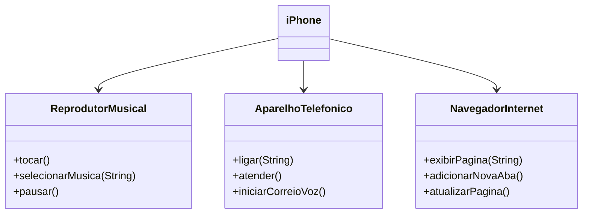

```mermaid
classDiagram
    class ReprodutorMusical {
        +tocar ()
        +selecionarMusica (String)
        +pausar ()
    }

    class AparelhoTelefonico {
        +ligar (String)
        +atender ()
        +iniciarCorreioVoz ()
    }

    class NavegadorInternet {
        +exibirPagina (String)
        +adicionarNovaAba ()
        +atualizarPagina ()
    }

    class iPhone {
    }

    iPhone --> ReprodutorMusical
    iPhone --> AparelhoTelefonico
    iPhone --> NavegadorInternet
```
